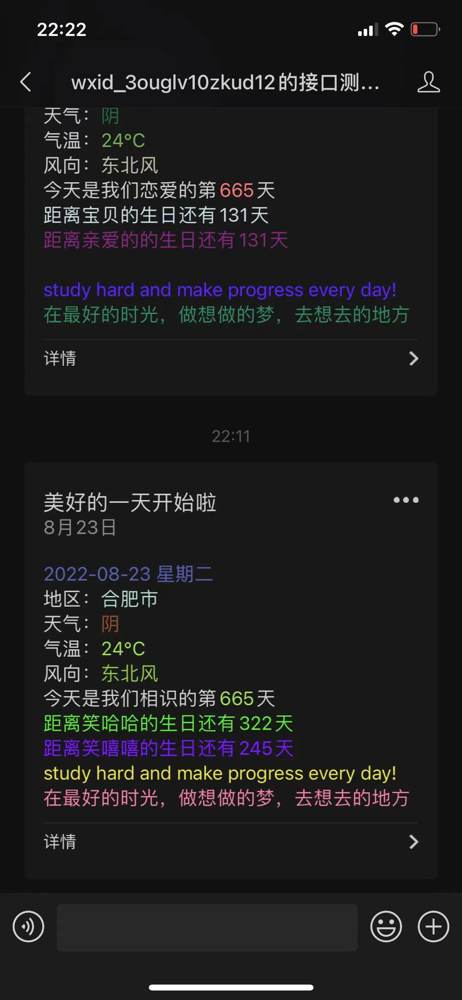
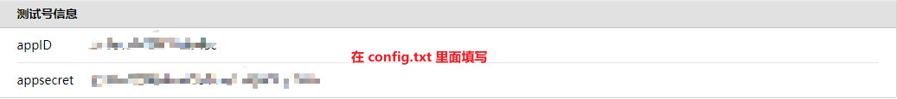
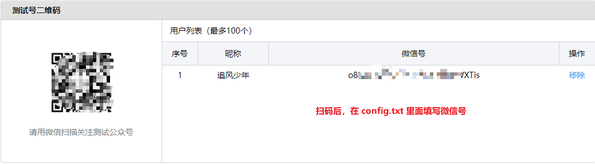
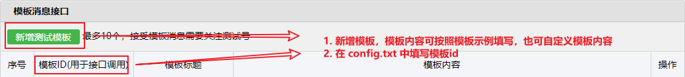
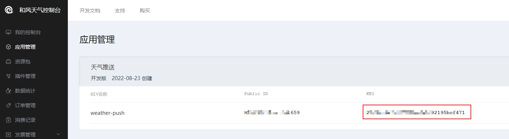

# 公众号天气推送（Python）

## 项目介绍
Python 项目（公众号推送早安问候以及天气预报）  
程序员必备撩妹工具，微信自动发送问候语以及天气预报，每天早中晚定时骚扰 

## 演示图例
 

## 准备工作
1. 微信公众平台接口测试账号申请：https://mp.weixin.qq.com/debug/cgi-bin/sandbox?t=sandbox/login   
2. 申请登录之后  
  
  
  
  
3. 在 config.txt 里面填写配置项信息

## 模板示例如下
```text
{{date.DATA}} 
地区：{{region.DATA}} 
天气：{{weather.DATA}} 
气温：{{temp.DATA}} 
风向：{{wind_dir.DATA}} 
今天是我们相恋的第{{love_day.DATA}}天 
{{birthday1.DATA}} 
{{birthday2.DATA}} 
{{note_en.DATA}} 
{{note_ch.DATA}}
```

## 关于和风天气
和风天气开放平台（注册登录）：https://dev.qweather.com/   
控制台创建应用（获取Key）：https://console.qweather.com/#/apps?lang=zh  
注意：在 config.txt 中的 weather_key 填写获取到的 Key  
  

## 如何运行
使用 PyCharm 编辑器，打开项目并运行，即可手动推送消息  